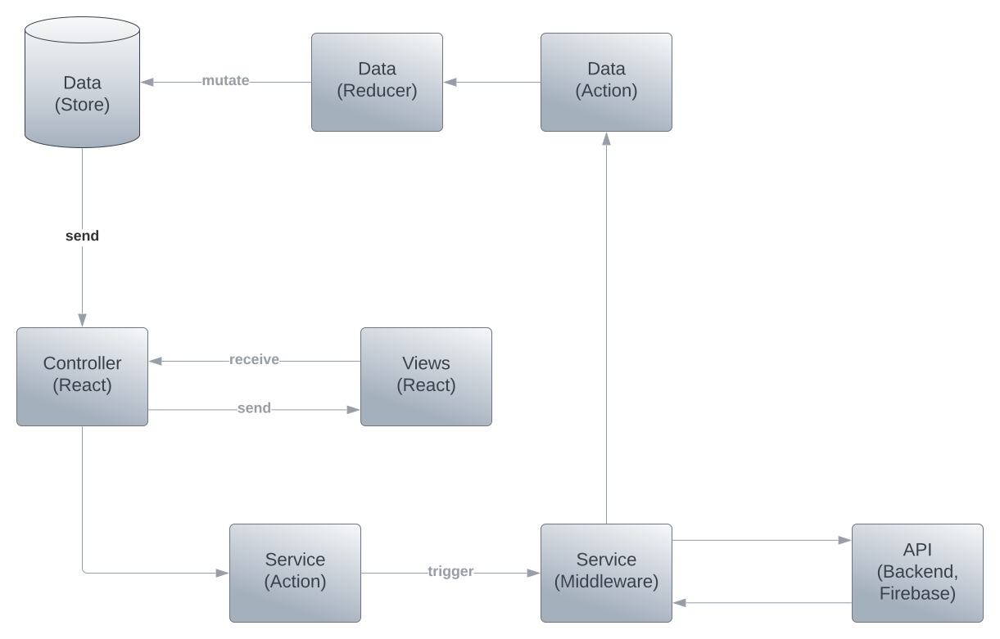

# Architecture

`CDR` Framework is a set of tools and libraries that allow you to create a component driven application using `Redux` and `React`. `CDR` Follows some Design Principles that are listed below:

## Design Principles

- `Single Source of Truth`: The state of your whole application is stored in an object tree within a single `Redux` store.
- `State is Read-Only`: The only way to change the state is to emit an `action`, an object describing what happened.
- `Dependecy Injection`: The only way to get data from `server` or `backend` or `firebase` is to inject it into the `store` using `middleware`.
- `Pure Functions`: To specify how the state tree is transformed by actions, you write pure `reducers`.
- `Single Responsibility`: Each component should have a single responsibility and should be independent of other components.
- `Separation of Concerns`: Separate the `state` from the `view` and `actions` from `reducers`.
- `Component Driven`: Each component should be independent of other components and should be able to be used in other projects.
- `Reusable`: Each component should be reusable and should be able to be used in other projects.
- `Testable`: Each component should be testable and should be able to be tested in other projects.
- `Scalable`: Each component should be scalable and should be able to be scaled in other projects.
- `Maintainable`: Each component should be maintainable and should be able to be maintained in other projects.
- `Extensible`: Each component should be extensible and should be able to be extended in other projects.

## Layers

- `Data`
  - `Data (Store)`
  - `Data (Reducer)`
  - `Data (Action)`
- `API (Backend, Server, Firebase)`
- `Service`
  - `Service (Middleware)`
  - `Service (Action)`
- `Controller (React)`
- `View (React)`

## Components

- `Data (Store)`: The `store` is the redux store that holds the state of the application.
- `Data (Reducer)`: The `reducer` is a pure function that takes the previous state and an action, and returns the next state. in simple terms it mutates the state.
- `Data (Action)`: The `action` is the only way to mutate the state. it is a plain object that describes what happened. this triggers the `reducer` to mutate the state.
- `Service (Middleware)`: The `middleware` is a function that is able to intercept an `action` and do something with it before it reaches the `reducer`. it is used to inject data from `server` or `backend` or `firebase` into the `store`.
- `API (Backend, Firebase)`: The `api` is the `server` or `backend` or `firebase` that is used to get data from. This layer is optional and is used to inject data into the `store` using `middleware`.
- `Service (Action)`: The `action` is the only way to trigger the middleware. it is a plain object that describes what happened. this triggers the `middleware` to commiuicate with the `api`.
- `Controller (React)`: The `controller` is a react component that is used to connect the `store` to the `view`. it is used to pass the `state` and `actions` to the `view`.
- `View (React)`: The `view` is a react component that is used to render the `state` and trigger the `actions`. it is used to render the `state` and trigger the `actions`.

## Summary

First of all the user visits the page when the app is mounted the `App` creates the `Data (Store)` with the Data Structure. The only way to mutate the `store` is `Data (Reducer)` and to trigger reducer and make use of it we need to dispatch an `Data (Action)`. The `Data (Action)` is triggered by the `Service (Middleware)` and the `Service (Middleware)` is triggered by the `Service (Action)`. The `Service (Action)` is triggered by the `Controller (React)` and the `Controller (React)` is triggered by the `View (React)`. The `View (React)` is rendered by the `Controller (React)` and the `Controller (React)` is rendered by the `App`. The `Controller` is solely responsible to get the data handle events while the `View` is only responsible to render the data.

## Why it is important?

When Building Large Scalable Application working with react requires you to follow some design principles and patterns. But Following the Design Principle and creating managle component can be hard and time consuming. Even though it is possible to create managable components but making good folder structure and managing the state can be hard. It is proven that `Redux` can handle state managemenet effeciently. So We Injected `Redux` into `React` and created a framework that follows the design principles and patterns and makes it easy to create managable components.